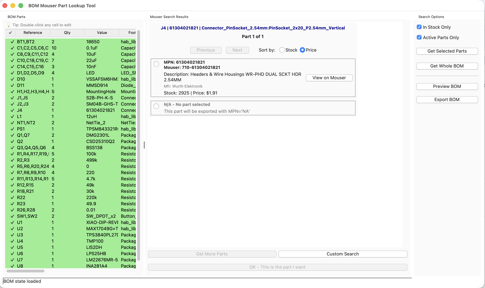
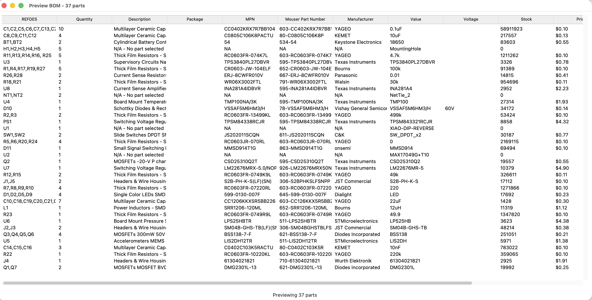

# BOM Helper - Mouser Part Lookup Tool

A Python GUI application that streamlines the process of finding and selecting Mouser Electronics parts for components in your Bill of Materials (BOM). The tool automatically parses Excel or CSV BOM files, intelligently searches the Mouser catalog using AI-powered keyword generation, and provides an intuitive interface for comparing and selecting the best parts based on availability, pricing, and lifecycle status.

## Project Context & History

**BOM Helper** automates this workflow by:
- Parsing BOM files with flexible column detection
- Using Google Gemini AI to generate intelligent search keywords from component descriptions
- Integrating with the Mouser API for real-time part searches
- Ranking results by stock availability, price, lifecycle status, and package matching
- Providing an interactive GUI for part selection and comparison
- Exporting selected parts for easy procurement

The application supports both Excel (`.xlsx`, `.xls`) and CSV formats, handles various BOM column naming conventions, and includes features like batch searching, state saving/loading, and in-cell editing for quick corrections.

## Features

### Core Functionality
- **Flexible BOM Parsing**: Automatically detects and normalizes columns in Excel/CSV BOM files, handling various naming conventions (RefDes, MPN, Value, Package, Voltage, etc.)
- **Intelligent Part Search**: Uses Google Gemini AI to generate search keywords from component descriptions when MPNs are unavailable
- **Mouser API Integration**: Real-time part searches with automatic MPN matching and keyword-based fallback
- **Smart Part Ranking**: Automatically ranks search results by:
  - Stock availability (prioritizes in-stock parts)
  - Price competitiveness
  - Lifecycle status (filters obsolete/EOL parts)
  - Package/footprint matching
- **Interactive GUI**: Tkinter-based interface with:
  - Editable BOM table (double-click any cell to edit)
  - Scrollable search results with detailed part information
  - Visual indicators for selected parts
  - Batch search capabilities
- **State Management**: Save and load BOM state (including selected parts) for later continuation
- **Export Functionality**: Export selected parts to CSV or Excel format for procurement


## Screenshots

<!-- Screenshot 1: Main Application Window -->
### Main Application Interface

*The main interface showing the BOM parts table (left) and Mouser search results (right).*

<!-- Screenshot 5: Export -->
### Preview / Exporting Selected Parts

*Exporting selected parts to Excel or CSV format.*

## Requirements

- **Python**: 3.7 or higher
- **Mouser API Key**: Part Search API key from [Mouser API Hub](https://www.mouser.com/api-hub/)
- **Google Gemini API Key** (optional but recommended): For intelligent keyword generation
- **Tkinter**: Usually included with Python, but may need separate installation on some systems

## Installation

### 1. Clone or Download the Repository

```bash
git clone <repository-url>
cd bomhelper
```

Or download and extract the ZIP file.

### 2. Install Dependencies

```bash
pip install -r requirements.txt
```

This installs:
- `openpyxl` - Excel file parsing
- `requests` - HTTP requests for Mouser API
- `google-generativeai` - Gemini AI integration

## Setup

### API Keys Configuration

The application requires API keys for Mouser and optionally Google Gemini. You can configure them in two ways:

#### Option 1: keys.txt File (Recommended)

Create a `keys.txt` file in the project root:

```
MouserAPIkey=your_mouser_api_key_here
GeminiKey=your_gemini_api_key_here
```

**Note:** Add `keys.txt` to `.gitignore` to avoid committing API keys to version control.

#### Option 2: Environment Variables

**Linux/macOS:**
```bash
export MOUSER_API_KEY=your_mouser_api_key_here
export GEMINI_API_KEY=your_gemini_api_key_here
```

**Windows:**
```cmd
set MOUSER_API_KEY=your_mouser_api_key_here
set GEMINI_API_KEY=your_gemini_api_key_here
```

For persistence, add these to your `~/.bashrc`, `~/.zshrc`, or Windows environment variables.

### Obtaining API Keys

#### Mouser API Key
1. Visit [Mouser API Hub](https://www.mouser.com/api-hub/)
2. Sign in or create a Mouser account
3. Request API access
4. You'll receive both a **Part Search API key** and an **Order API key**
5. This tool uses the **Part Search API key**

#### Google Gemini API Key (Optional but Recommended)
1. Visit [Google AI Studio](https://makersuite.google.com/app/apikey)
2. Sign in with your Google account
3. Create a new API key
4. Copy the key for use in the application

## Usage

### Running the Application

```bash
python bom_mouser_lookup.py
```

Or if using system Python with tkinter:

```bash
/usr/bin/python3 bom_mouser_lookup.py
```

### Basic Workflow

1. **Open BOM File**
   - Click `File > Open BOM...`
   - Select your Excel (`.xlsx`, `.xls`) or CSV file
   - The tool will automatically detect columns and parse components

2. **Review BOM Parts**
   - The left panel shows all components from your BOM
   - Parts are automatically consolidated by MPN or Value+Package
   - Reference designators are aggregated (e.g., "R1, R2, R3")

3. **Search for Parts**
   - Click on a component in the BOM table
   - If the component has an MPN, the tool automatically searches Mouser
   - If no MPN exists, Gemini AI generates a search keyword and searches automatically
   - Search results appear in the right panel, ranked by relevance

4. **Select Parts**
   - Review search results showing:
     - Mouser Part Number
     - Manufacturer and MPN
     - Description
     - Stock availability
     - Price breaks
     - Lifecycle status
     - Package/footprint
   - Click "Select" on a part to choose it for that component
   - Selected parts are marked with a checkmark in the BOM table

5. **Edit BOM Data** (Optional)
   - Double-click any cell in the BOM table to edit it
   - Useful for correcting MPNs or adding missing information
   - Changes are saved to the in-memory BOM data

6. **Custom Search** (Optional)
   - If automatic search doesn't find desired parts, use the custom search box
   - Enter a part number or search term manually
   - Click "Search Mouser" to perform a keyword search

7. **Save State** (Optional)
   - Click `File > Save BOM State...` to save your progress
   - Includes BOM data and selected parts
   - Useful for large BOMs that take time to process

8. **Export Selected Parts**
   - Click `File > Export BOM...`
   - Choose CSV or Excel format
   - The exported file contains all components with their selected Mouser parts

#### State Management
- **Save State**: `File > Save BOM State...` - Saves current BOM and selections
- **Load State**: `File > Load BOM State...` - Restores previous session

#### API Key Management
- `Settings > API Keys...` - View or update API keys
- Changes take effect immediately

## BOM File Format

The tool supports flexible BOM formats and automatically detects common column names. It recognizes various naming conventions:

### Recognized Column Names

| Standard Name | Variations |
|--------------|------------|
| **RefDes** | RefDes, Ref, Reference, Reference Designator, Designator |
| **MPN** | MPN, Manufacturer Part Number, Part Number, Part#, Mfr Part Number |
| **Value** | Value, Component Value, Val |
| **Package** | Package, Footprint, Case, Case Code, Size |
| **Voltage** | Voltage, Voltage Rating, V Rating, V |
| **Tolerance** | Tolerance, Tol |
| **Power** | Power, Power Rating, Wattage, W |
| **Description** | Description, Desc, Comment, Notes |
| **Quantity** | Quantity, Qty, Qty per Board |

### File Requirements

- **Headers**: First row must contain column headers
- **Data**: Component data starts from the second row
- **Minimum**: At least one column (RefDes or MPN recommended)
- **Formats**: Excel (`.xlsx`, `.xls`, `.xlsm`) or CSV (`.csv`)

### Example BOM Structure

| RefDes | MPN | Value | Package | Voltage | Tolerance | Description |
|--------|-----|-------|---------|---------|-----------|-------------|
| R1 | RC0603FR-071KL | 1k | 0603 | 50V | 1% | Resistor |
| C1 | CL10A104KA8NNNC | 0.1uF | 0603 | 25V | 10% | Capacitor |
| U1 | LM358N | - | DIP-8 | - | - | Op-Amp |

The tool will extract all columns present in your BOM, so additional custom columns are also supported.

## Architecture & Technical Details

### Component Overview

- **`bom_parser.py`**: Handles parsing of Excel and CSV files, column normalization, and part consolidation
- **`mouser_api.py`**: Mouser API client with rate limiting, error handling, and result normalization
- **`part_ranker.py`**: Scoring engine that ranks parts by stock, price, lifecycle, and package matching
- **`spec_parser.py`**: (Deprecated) Legacy spec parsing - functionality moved to main app with Gemini integration
- **`config.py`**: Configuration management for API keys from `keys.txt` or environment variables
- **`bom_mouser_lookup.py`**: Main GUI application with Tkinter interface

### Search Strategy

1. **MPN Search** (if available): Exact match search using Mouser's Part Number API
2. **Keyword Search** (fallback): Uses Gemini AI to generate search keywords from component description, then searches Mouser
3. **Filtering**: Results are filtered by:
   - Stock availability (configurable)
   - Lifecycle status (filters obsolete/EOL parts)
4. **Ranking**: Parts are scored and ranked by:
   - Stock availability (30% weight)
   - Price competitiveness (50% weight)
   - Lifecycle status (10% weight)
   - Package matching (10% weight)

### Data Flow

```
BOM File → BOMParser → Consolidated Parts → GUI Table
                                              ↓
                                    User Selects Part
                                              ↓
                                    Gemini (if needed) → Keyword
                                              ↓
                                    MouserAPI → Search Results
                                              ↓
                                    RankingEngine → Ranked Results
                                              ↓
                                    User Selects Part → Selected Parts
                                              ↓
                                    Export → CSV/Excel
```

## File Structure

```
bomhelper/
├── bom_mouser_lookup.py    # Main GUI application
├── bom_parser.py           # BOM file parsing (Excel/CSV)
├── mouser_api.py           # Mouser API client
├── part_ranker.py          # Part ranking/scoring engine
├── spec_parser.py          # (Deprecated) Legacy spec parser
├── config.py               # Configuration management
├── requirements.txt        # Python dependencies
├── recreate_venv.sh       # Virtual environment setup script
├── keys.txt               # API keys (create this, add to .gitignore)
├── bom_helper.log         # Application log file
└── README.md              # This file
```

## Logging

The application logs to both console and `bom_helper.log`. Log levels include:
- **INFO**: General application flow
- **DEBUG**: Detailed API requests and scoring information
- **WARNING**: Non-critical issues (e.g., missing API keys)
- **ERROR**: Errors that may affect functionality

To enable debug logging, modify the logging configuration in `bom_mouser_lookup.py`:

```python
logging.basicConfig(level=logging.DEBUG, ...)
```
